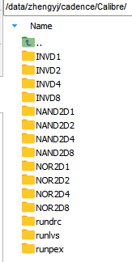
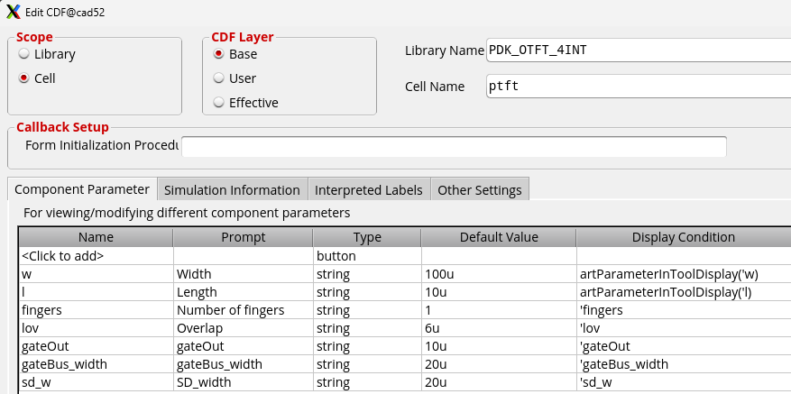

[TOC]

# 基础知识
单元库生成流程补充内容：大多数用到的命令行、脚本等文件均可利用AI生成，此处只给出文件代码要求。
cadence的启动目录：你在哪个路径下输入virtuoso&，哪里就是启动目录。启动目录下的cds.lib
更多细节可以参考：
1. https://www.zhihu.com/column/c_1954996465119257663
1. 《模拟集成电路仿真与实用性电路分析——基于Cadence® Virtuoso® ADE Assembler/Explorer》 作者小红书主页：https://www.xiaohongshu.com/user/profile/680535c4000000000a03f708?xsec_token=ABTGY5PhTufUqQbp675uIzsGB2Cf4y6e0hRxfm7Q-TfDg%3D&xsec_source=pc_search

更换工艺PDK后，从abstract步骤重新开始更新包含工艺信息的lef和tlef文件即可，Siliconsmart步骤不涉及PDK工艺信息，只涉及器件模型.l文件；同理，如果只更换了模型.l文件，没有更改PDK，只需要重新Siliconsmart建设.lib文件即可。
.l文件中的tox= 1e-07/2.3中间的/前后不能有空格，否则Siliconsmart会识别不出来。2.3是是一个华大九天的仿真结果到cadence仿真的一个修正参数，这个是一个粗略的修正，可以以后修改更细致。
.l文件每次更新名字之后，记得修改在.LIB ptft和.LIB ptft_mac里面引用的.l模型名字。

# linux基础
mobaxterm命令行直接在命令行输入多行if语句，换行时Shell会以为命令不完整：
将命令写成单行，用分号分隔：    将多行语句写入脚本文件（如myscript.sh），然后用 bash myscript.sh 执行。
清除mobaxterm命令行的输出内容：Ctrl+ L；
导出mobaxterm命令行的输出内容:软件左上方terminal -> save terminal text
更改mobaxterm的命令行背景颜色：setting -> Terminal -> default Terminal color setting
在mobaxterm的SSH browser中显示.开头的被隐藏的文件：https://blog.csdn.net/qq_38473254/article/details/137367248 。需要正确修改.cdsinit和.cdsenv，有时候上传之后会自动消失.这个符号。

服务器下载大型文件夹建议先压缩再下载
```
cd /data/zhengyj/cadence/
tar -czf PDK_OTFT_4INT.tar.gz PDK_OTFT_4INT/ OTFT_stdlib_cells_4INT/ .cdsenv .cdsinit
tar -czf TFT_all_packages.tar.gz PDK_OTFT_4INT/ TFTmodel/ PDK_OTFT_251202/
scp -P 22 zhengyj@design.nics4304.top:/data/zhengyj/cadence/TFT_all_packages.tar.gz "C:/Users/qiaox/Desktop/"
```


# tcl基础

```
set path [file dirname [info script]] #获取tcl脚本所在文件夹的路径并存储在path变量
```
# schematic基础


# Calibre
好用的skill脚本：https://bbs.eetop.cn/thread-878287-1-1.html
使用快捷键O绘制通孔的时候，需要确认两层金属都完全覆盖通孔，不能靠通孔自带的金属覆盖，否则疑似会有LVS报错。
存在多个PDK的时候，希望不同的library根据链接的PDK找到对应的display.drf文件，需要在.cdsinit文件中添加代码 ，参见/data/zhengyj/cadence/路径下的.cdsinit配置，.cdsenv文件对环境变量进行设置。
需要在.cdsinit文件的132\~133，173\~174修改对应的不同PDK的名字和文件路径。


```
#启动virtuoso命令
ssh cad1
cd /data/zhengyj/cadence/
source /data/cshrc/.cshrc.cadence
source /data/tangwj/.cshrc.synopsys
virtuoso&
abstract
```

**在leBindKeys.il快捷键设置的脚本中：list("Ctrl<Key>P"	"leHiCreatePin()")设置了版图中绘制pin的快捷键是ctrl+p。只有在最终的layout中绘制pin才能被abstract正确提取，快捷键l对应的label只能被lvs对应上。**
注意一定都是显示蓝字，如果出现黄字 pin 说明选错了，可以看到 pin 名在 M1(pin)、M2(pin)层。

通过 Cadence Calibre 的 PEX 寄生提取：OUTPUT 这里选择 RCC；
输出格式修改：点击PEX Netlist，Netlist Path中修改文件后缀，从pex.netlist 修改成.cdl；Netlist Format：之前默认是 spectre / ELOD仿真，此处仿真器修改为 HSPICE。
实际上以后只需要把提取的cdl相关文件存放在pex文件夹即可，不需要创建pex_cdl文件夹，此处是因为前期pex存放了netlist格式的寄生体取参数文件，于是统一把cdl文件存放到pex_cdl中。
```
# 整个library变成只读后修复：
chmod -R 755 /data/zhengyj/cadence/OTFT_stdlib_cells_4INT/

# 创建文件夹
mkdir -p /data/zhengyj/cadence/Calibre/{BOUNDARY_LEFT,BOUNDARY_RIGHT,FILL1,FILL2,FILL4,FILL8,FILL16,FILL32,FILL64,FILL128}/{drc,lvs,pex_cdl,pex}
mkdir -p /data/zhengyj/cadence/Calibre/{DFFD1}/{drc,lvs,pex_cdl,pex}
mkdir -p /data/zhengyj/cadence/Calibre/{BUFD2,BUFD4,BUFD8}/{drc,lvs,pex_cdl,pex}
mkdir -p /data/zhengyj/cadence/Calibre/{BOUNDARY_LEFT,BOUNDARY_RIGHT,BUFD2,BUFD4,BUFD8,DFFD1,FILL1,FILL128,FILL16,FILL2,FILL32,FILL4,FILL64,FILL8,INVD1,INVD2,INVD4,INVD8,NAND2D1,NAND2D2,NAND2D4,NAND2D8,NOR2D1,NOR2D2,NOR2D4,NOR2D8}/{pex_cdl}

# 命令行把/data/zhengyj/cadence/Calibre/路径下的各个子文件夹里面的pex_cdl文件夹改名为pex_cdl_oldVIA
find /data/zhengyj/cadence/Calibre/ -type d -name "pex_cdl" -exec bash -c 'mv "$0" "$0"_oldVIA' {} \;

```

建议每个把版图文件pex的结果各自放在一个文件夹，最后所有的版图文件提取完后利用命令行语句，批量把每个.cdl、.pex、.pxi文件导出来到/data/zhengyj/OTFT_stdlib/的subckts文件夹。

## layout常用快捷键
https://blog.csdn.net/qq_40007892/article/details/127234270
https://zhuanlan.zhihu.com/p/471942740
https://www.bilibili.com/read/cv19695919/?opus_fallback=1

```
layout:Shift + M 这是执行 Merge 命令的默认快捷键。Edit -> Merge。  
选择 Edit -> Basic -> Split。操作：点击你想要拆分的多边形边缘，工具会尝试根据形状的转折点将其切回多个矩形。
按下 Shift + C。按下快捷键后，在版图窗口点击鼠标左键。拉出一个矩形框，框住你想要删掉的那部分金属。再次点击左键，选中的部分就会被移除。
Shift + T 是解除cell之间的调用关系，把选中的元器件当成独立的个体，而非调用的其他单元，解除耦合，如果单元库的版图调用了其他创建的cell(例如via)，解除后理论上更方便。
F2保存版图文件。
```

## 更换单元库的PDK&gds number
OTFT_stdlib_cells的layout链接的工艺库是PDK_OTFT_251202，我把OTFT_stdlib_cells复制了一份并重命名OTFT_stdlib_cells_4INT，如何把OTFT_stdlib_cells_4INT里面的版图链接的工艺库改为PDK_OTFT_4INT：
在 Virtuoso 主窗口（CIW）菜单栏，点击 Tools -> Technology File Manager；
点击中间的 Attach... 按钮；
在 Design Library 下拉框中，选择你复制出的新库：OTFT_stdlib_cells_4INT；
在 Technology Library 下拉框中，选择新的 PDK 库：PDK_OTFT_4INT。

更换gds number后，使用skill脚本批量复制OTFT_stdlib_cells单元库cell到新的libraryOTFT_stdlib_cells_4INT：
```
load("MigrateAndCleanupLib .il") 或者load("/data/zhengyj/cadence/MigrateAndCleanupLib.il")
```
复制过后，因为是按照gds number对应，会有层级混乱，所以需要修改顺序，利用skill脚本，把OTFT_stdlib_cells_4INT这个library里面的所有版图的M1 drawing改成MC drawing，Via2 drawing改成M1 drawing：
```
load("RemapLayersSequence.il")  或者load("/data/zhengyj/cadence/RemapLayersSequence.il")
```
从windows系统复制sh脚本之后，需要把Windows 格式的换行符（\r\n，CRLF）替换， Linux 只能识别 Unix 格式的换行符（\n，LF）：
```
sed -i 's/\r//' /data/zhengyj/cadence/export_gds_final.sh
```
layout复制完毕后，再利用skill脚本，把OTFT_stdlib_cells里面的所有cell的schematic和symbol复制到OTFT_stdlib_cells_4INT对应的cell中，命令行中运行：
```
chmod +x /data/zhengyj/cadence/copy_cells.sh
bash /data/zhengyj/cadence/copy_cells.sh
```
复制之后需要更换ptft器件的library，CIW中运行：
```
load("rename_inst.il") 或者load("/data/zhengyj/cadence/rename_inst.il")
```
批量导出版图的gds：
```
chmod +x /data/zhengyj/cadence/export_gds_final.sh
/data/zhengyj/cadence/export_gds_final.sh
```

## Calibre代码
```
#利用linux命令行，把/data/zhengyj/cadence/Calibre/路径下各个子文件夹里面的pex_cdl文件夹里面的.cdl、.pex、.pxi后缀的文件复制到/data/zhengyj/OTFT_stdlib/的subckts_cdl文件夹，如果有重复名字的文件就覆盖
find /data/zhengyj/cadence/Calibre/ -path "*/pex_cdl/*" -type f \( -name "*.cdl" -o -name "*.pex" -o -name "*.pxi" \) -exec cp -f {} /data/zhengyj/OTFT_stdlib/subckts_cdl/ \;

# 处理当前目录及所有子目录中的文件,修改cdl文件的绝对路径
find /data/zhengyj/OTFT_stdlib/subckts/ -type f -name "*" -exec sed -i 's|^\.include "subckts/|.include "/data/zhengyj/OTFT_stdlib/subckts/|g' {} \;
find /data/zhengyj/OTFT_stdlib/subckts_cdl/ -type f -name "*" -exec sed -i 's|^\.include "|.include "/data/zhengyj/OTFT_stdlib/subckts_cdl/|g' {} \;
```
rundrc中存放drc的runset的文件，以此类推，文件名即为单元库电路的名字。
Cadence 加载 display.drf 的默认顺序通常是：安装路径 -> 用户主目录 (~/) -> 启动目录 (./)。后加载的会覆盖先加载的。
drf文件更新后需要重新启动。

## Pcell代码
Pcell即参数化单元，它是一种可编程单元，允许用户在创建单元的时候自定义参数。PDK里的晶体管、电容、电感等元件，就是Pcell。使用Cadence SKILL脚本可以创建一个Pcell。创建完成后，就可以调用该Pcell，并随时自定义其参数，而无需再运行脚本了，自动化程度更上一层楼。
第一次使用的时候，检查脚本第一行，选定需要绑定的工艺库和晶体管名称，在CIW窗口执行load("/data/zhengyj/cadence/scripts/ptft.il")。即可看到模型ptft的cell view中多了layout。
```
sd_w是每个S/D金属条的长度；gateOut是两侧gate相对于S/D伸出去的长度；gateBus_width是两侧连接叉指型晶体管gate的走线宽度。
```
ptft.il脚本修改特点：AI给的代码基本不可用，会使用一些识别不出的函数，所以建议在基础代码上更改，貌似不能使用科学计数法（存疑），


执行完脚本后，还需要在CIW窗口的Tools->CDF->Edit中修改对应的参数，具体相关内容可参考《模拟集成电路仿真与实用性电路分析——基于Cadence® Virtuoso® ADE Assembler/Explorer》中9.3的相关内容。
始终在layout选取instance的时候显示：直接在 CDF的displayCondition 框中填入 t，或者以'加在参数名前面，例如'w。


## Layout XL 自动生成器件并布线
目前只能做到自动生成器件，布线操作没有反应。
参考资料：
https://zhuanlan.zhihu.com/p/689403864
https://www.bilibili.com/opus/727243065534709782


# abstract提取LEF文件
File→library→Open;在abstract中鼠标中键是复制
图3.9的(c)因为LTPS版图中的VDD VSS高15um，而整体是12-track共72um，这里就取了上下中间值的坐标7.5和7.5+72=79.5。因为单元库是87um，上下各截取7.5，最终变成72um。    实际可以不填写让版图自己识别。
把/data/zhengyj/cadence/OTFT_stdlib_cells_4INT/路径下所有带有abstract或者logic名字的文件夹删除：
```
find /data/zhengyj/cadence/OTFT_stdlib_cells_4INT/ -type d \( -name "*abstract*" -o -name "*logic*" \) -exec rm -rf {} \;
```
tlef文件中会出现单元库版图中使用的layer，还有PDK所规定的所有的layer，从而可以在后端自动布局布线中被innovus使用所有金属层，但是lef文件中只会出现单元库版图使用的金属层，所以在abstract配置的过程中只需要选择单元库版图中出现的金属层。
生成 logical 后，pins提取配置
```
Map text labels to pins:
((M1 pin) (M1 drawing))
((M2 pin) (M2 drawing))
((M3 pin) (M3 drawing))
((M4 pin) (M4 drawing))
((M5 pin) (M5 drawing))

Power pin names (regular expressions):
^((V(DD|CC))|(v(dd|cc)))(!)?$

Ground pin names (regular expressions):
^((VSS|GND)|(vss|gnd))(!)?$

Clock pin names (regular expressions):
CK

Create boundary.Using geometry on layers:
(M1 MC M2 Via1 )

layer connectivity
(M2 M1 Via1 ) (M2 MC Via1 ) (M3 M2 Via2 ) (M4 M3 Via3 ) (M5 M4 Via4 )

```


提取lef和tlef文件的时候存在warning：
```
Running: lefout -lib OTT_Tstdlib.cells -views "abstract" -log lefout.log -lef /data/zhengyj/adence/OTT_Tstdlib_lib/OTT_Tstdlib_13/OTT_Tstdlib_13.lef -ver 5.7 -tech
WARNING (ORLEFDEF-50144): NONDEFAULT virtualDefautlSetup: LAYER-MC: invalid definition. This rule will be ignored. Ensure all layers in the valid routing layer
WARNING (ORLEFDEF-50144): NONDEFAULT virtualDefautlSetup: LAYER-MC: invalid definition. This rule will be ignored. Ensure all layers in the valid routing layers con
```
因为PDK的.tf文件中：virtuosoDefaultSetup 和 VLMDefaultSetup 中的规则定义MC也是金属，但是随后在layerRules中定义MC为pseudometal不参与布局布线，如果有布线需求，可以把MC修改为metal，但是会产生大量未知的寄生晶体管，不推荐。

**自动生成的tlef中金属层的顺序有问题，要按顺序Metal 1 -> Via 1 -> Metal 2 -> Via 2(原因是tlef的提取可能是按照gds number执行的，原来的排序比较混乱，更新后的PDK_OTFT_4INT的gds number是符合工艺顺序的，无需更改)**
模仿LTPS_TFT_stdlib.tlef，按照可以使用的tlef文件删除、修改、添加内容：
1.删除开头的(删除了在innovus时候会有warning，可以保留)
```
UNITS
  DATABASE MICRONS 1000 ;
END UNITS
```
2.删除末尾的
```
virtuosoDefaultSetup和virtuosoDefaultExtractorSetup相关内容即可工作，这两个部分是根据tf文件生成的，LTPS的参考步骤没有这部分。
NONDEFAULTRULE virtuosoDefaultSetup
  LAYER M1
    WIDTH 12 ;
  END M1
  LAYER M2
    WIDTH 12 ;
  END M2
  LAYER M3
    WIDTH 12 ;
  END M3
  LAYER M4
    WIDTH 12 ;
  END M4
  LAYER M5
    WIDTH 12 ;
  END M5
  USEVIARULE M2_M1 ;
  USEVIARULE M2_MC ;
  USEVIARULE M3_M2 ;
  USEVIARULE M4_M3 ;
  USEVIARULE M5_M4 ;
END virtuosoDefaultSetup

NONDEFAULTRULE virtuosoDefaultExtractorSetup
  LAYER M1
    WIDTH 30 ;
  END M1
  LAYER M2
    WIDTH 30 ;
  END M2
  LAYER M3
    WIDTH 30 ;
  END M3
  LAYER M4
    WIDTH 30 ;
  END M4
  LAYER M5
    WIDTH 30 ;
  END M5
  USEVIARULE M2_M1 ;
  USEVIARULE M2_MC ;
  USEVIARULE M3_M2 ;
  USEVIARULE M4_M3 ;
  USEVIARULE M5_M4 ;
END virtuosoDefaultExtractorSetup


```
3.在末尾添加
```
SITE CoreSite
  CLASS CORE ;
  SYMMETRY Y ;
  SIZE 10 BY 900 ;
END CoreSite
```
也可以选择批量替换lef文件的CoreSite，改成core后可以仿照LTPS单元库的代码，只要和innovus中使用的命令对应即可(进行到对应步骤的时候会再次提示)。本实例采用保持CoreSite的方式。
**理论上未必需要删除开头和末尾的部分代码，但是需要添加代码，可以后续继续尝试。**
**/data/zhengyj/cadence/OTFT_stdlib_lib/路径存储的是abstract提取出的原始版本，经过修改后，放在/data/zhengyj/OTFT_stdlib/OTFT_stdlib_lib/的对应工艺文件夹下。**

命令行把/data/zhengyj/OTFT_stdlib/OTFT_stdlib_lib/OTFT_stdlib_16_4INT_PAA/路径下所有文件名带有OTFT_stdlib_16_4INT的文件的OTFT_stdlib_16_4INT改成OTFT_stdlib_16_4INT_PAA
```
# 直接显示当前正在运行的 shell 名称
echo $0

# 默认是csh，需要切换到bash来运行代码：
bash

find /data/zhengyj/OTFT_stdlib/OTFT_stdlib_lib/OTFT_stdlib_16_4INT_PAA/ -type f -name "*OTFT_stdlib_16_4INT*" | while read file; do
    # 拆分目录路径和纯文件名
    dir_path=$(dirname "$file")
    file_name=$(basename "$file")
    # 仅替换文件名中的字符串
    new_file_name=$(echo "$file_name" | sed 's/OTFT_stdlib_16_4INT/OTFT_stdlib_16_4INT_PAA/')
    # 拼接新路径
    newfile="$dir_path/$new_file_name"
    # 执行重命名
    mv "$file" "$newfile"
done
```


# Siliconsmart
```
ssh cad1
cd /data/zhengyj/OTFT_stdlib/
source /data/cshrc/.cshrc.cadence
source /data/tangwj/.cshrc.synopsys
siliconsmart
```
设置文件夹路径 /data/zhengyj/OTFT_stdlib/，之后都在这里运行。
在该路径下建立文件夹lib_template存放模板lib文件，subckts文件夹存放Calibre生成的版图.cdl、.pex、.pxi文件。
configure.tcl文件的.l文件包含器件物理信息，并且其中的单元库的名字(OTFT_stdlib)要和.lib文件中line15的library(OTFT_stdlib)对应，line17的工艺名称technology (OTFT)无特别要求，可以自行命名。

## configure.tcl 脚本配置
**修改configure.tcl的配置之后，经常会出现Error:   Syntax error, line 416: Expected ')'. (LIBT-9)报错，需要把所有当做换行符的)删除，把数据放到一行后可以运行。**
单独给DFF做了一个lib，OTFT_stdlib_DFF_good.lib/OTFT_stdlib_DFF_wo.lib，配置是configure_DFF.tcl，用时40min提取成功。
为了把DFF和无时序信息的逻辑门一起生成lib，需要使用python脚本("C:\THU\课题组\数字电路设计全流程\THU_OTFT_stdlib_public\Siliconsmart脚本与单元库\DFF可用的lib与tcl\py\flatten_values.py")把value的数值全部换成一行，然后.lib开头的header部分使用OTFT_stdlib_DFF_wo.lib的配置。
以后configure.tcl脚本可以一直使用/data/zhengyj/OTFT_stdlib/tcl/siliconsmart/configure_DFF.tcl，除非时序再报错。

```
set largest_load 最大是3e-8
错误 PARA-11：largest_slew 参数（以及相关的采样点）默认不允许超过 1ms (0.001s)
run_list_maxsize 不是1多线程会出错

修改scheduler_poll_time 可以改变命令行输出进度的时间间隔(单位s)

延长仿真时长 (sim_time_limit)： OTFT 的迁移率通常比单晶硅低 4-6 个数量级。原始配置可能导致仿真在电平翻转到一半时就停止了。将限制放宽到 10ms（1e-2）可以确保 DFF 完整经历 Setup/Hold 和传播延迟过程。

增大输入斜率 (explicit_points_slew)： 如果你给 D 端或 CK 端一个 1ns 的脉冲，OTFT 器件根本来不及感应信号。将斜率点设置在 1us 到 2ms 之间，符合 1kHz 工作频率的实际物理情况。

调整驱动时间 (driver_rise_time)： 输入激励的上升/下降时间从 1ns 增加到 0.1ms。这样仿真器生成的输入波形才是有意义的，避免产生“理想阶跃信号”导致仿真收敛困难。

提高时间分辨率 (time_res_high)： 由于时间尺度变大，测量精度不需要维持在 1e-9（1ns），改为 1e-6（1us）。同时调大 nochange_variance，防止 SiliconSmart 误判慢速爬升的电平为恒定电平。
增大负载范围 (largest_load)： 考虑到 12-track 的 OTFT 单元尺寸较大，且寄生效应明显，将最大负载从 1e-6（通常过大）或 1e-15（过小）调整到合理的 50pF 量级。
```

**Siliconsmart 的 Tcl 控制台不直接支持 Linux Shell 命令，但可通过Tcl 内置命令调用 Linux 系统命令，核心方法是exec，补充方法是system：**
exec 在执行外部命令时，如果命令返回非零状态（如权限不足、目录不存在），会向 Tcl 脚本抛出一个错误，导致脚本停止运行。catch 的作用就是“抓住”这个错误，不让它影响脚本后续的执行。
```
exec <Linux命令> [命令参数]
```

## Siliconsmart代码

可以直接调用tcl自动化脚本，每次使用时需要确认里面的lib文件和configure文件路径是否正确。
```
source /data/zhengyj/OTFT_stdlib/tcl/siliconsmart/run_siliconsmart.tcl
exit
```
**调用脚本之前，检查run_siliconsmart.tcl里面的配置**
```
lib_name检查采用哪个模板，woBackslash对应着没有换行的版本，在修改单元库之后都要用这个
config_name要选用/data/zhengyj/OTFT_stdlib/tcl/siliconsmart/里面对应的脚本，主要分为PAA和普通的两种，都采用加入DFF之后的configure。
configure.tcl中，更换PAA工艺，需要修改.l文件路径，add_opc_supplies OTFT_stdlib的VDD参数
检查/data/zhengyj/OTFT_stdlib/subckts_cdl文件夹里面是否是对应的版图寄生体取参数文件。疑似.cdl文件内部的引用不改成绝对路径也可以正常使用。

```


也可以分步进行：
```
exec [ -d "/data/zhengyj/OTFT_stdlib/my_library" ] && echo "正在删除..." && rm -rf "/data/zhengyj/OTFT_stdlib/my_library"

create my_library
```
创建后在config文件夹中复制configure.tcl文件，netlist文件夹中复制subckts文件夹中的版图文件。
(理论上版图.cdl文件中include .pex和.pxi的两条语句的绝对路径改到netlist文件夹，就可以不需要subckts文件夹。)

```

exec cp /data/zhengyj/OTFT_stdlib/tcl/siliconsmart/configure.tcl /data/zhengyj/OTFT_stdlib/my_library/config/

set_location my_library

# 把/data/zhengyj/OTFT_stdlib/subckts_cdl/路径下的全部文件复制到/data/zhengyj/OTFT_stdlib/my_library/netlists/
exec cp -r /data/zhengyj/OTFT_stdlib/subckts_cdl/. /data/zhengyj/OTFT_stdlib/my_library/netlists/

import -liberty /data/zhengyj/OTFT_stdlib/lib_template/OTFT_stdlib_ref13.lib -netlist_dir my_library/netlists -ext .cdl -overwrite -use_default_slews

# 如果不叫configure.tcl，需要指定配置文件  configure -file "config/1.tcl" -timing -power all
configure -timing -power all

characterize all

model -create_new_model -file my_library/models/OTFT_stdlib.lib all -library_type typ
```
以上代码只有characterize all执行时间比较久，一个版图大概6min。
执行完毕后，可以在my_library/models路径下看到OTFT_stdlib.lib单元库文件。
拷贝lib文件，给Library Compiler转换成db文件。
```
cp /data/zhengyj/OTFT_stdlib/my_library/models/OTFT_stdlib.lib /data/zhengyj/OTFT_stdlib/OTFT_stdlib_lib/OTFT_stdlib_16_4INT_PAA/OTFT_stdlib_16_4INT_PAA.lib
```
拷贝之后别忘记添加area。
建立存放.lib、lef、tlef、db的文件夹。
```
mkdir -p /data/zhengyj/cadence/OTFT_stdlib_lib/OTFT_stdlib_16
mkdir -p /data/zhengyj/OTFT_stdlib/OTFT_stdlib_lib/OTFT_stdlib_16
mkdir -p /data/zhengyj/OTFT_stdlib/OTFT_stdlib_lib/OTFT_stdlib_16_4INT_PAA
```


# Library Compiler

确认lib_to_db.tcl的lib和db的文件路径后，执行代码：
```
cd /data/zhengyj/OTFT_stdlib/ 
lc_shell
source /data/zhengyj/OTFT_stdlib/tcl/lc/lib_to_db.tcl
exit
```
执行完毕后，在/data/zhengyj/OTFT_stdlib/OTFT_stdlib_lib/OTFT_stdlib_libxx路径下出现db文件，给后续DC综合使用。

lib_to_db.tcl原始代码：

```
set cells {OTFT_stdlib_13}
cd /data/zhengyj/OTFT_stdlib/OTFT_stdlib_lib/${cell}

foreach cell $cells {
    read_lib ${cell}.lib
    write_lib -format db OTFT_stdlib -output ${cell}.db
}

# write_lib 第一个OTFT_stdlib是.lib文件的library(OTFT_stdlib)名字,第二个是生成db文件的名字。
```

**执行过程会有warning，因为部分pin(OUT)的power value是负数。**
在表征（Characterization）过程中，由于仿真器（如 Spectre/Hspice）的数值计算误差，或者是在计算 $P_{total} - P_{switching}$ 时，得到的内部功耗为负数/在某些极端 Corner 下，拟合出的输入电容或 Miller 电容可能出现数学上的负值。
在逻辑综合阶段通常没有致命影响，但在功耗分析和时序签核（Sign-off）阶段存在风险。
A. 逻辑综合 (Design Compiler)影响较小：DC 在读取 .db 文件时会接受这个负值。它主要影响的是工具对电路功耗的估算。如果该值为负，综合工具可能会错误地认为这个 Cell 不仅不耗电，反而能“产生能量”。
B. 功耗分析 (PrimePower / Primetime PX)风险较大：如果你进行全芯片功耗评估，负值的内部功耗会导致最终的功耗报告偏低。如果负值非常大（如你这里的 $-142500$），可能会让局部的功耗统计变得毫无意义。
C. 静态时序分析 (Primetime)潜在风险：如果这个负值出现在 leakage_power 或者 capacitance 属性中，可能会导致 PT 在分析时出现警告甚至由于数据异常导致计算出的 Delay 不准（虽然 LBDB-272 更多针对功耗）。

# Design Compiler

```
# 执行前复制一份备份
cp -r /data/zhengyj/OTFT_stdlib/OTFT_stdlib_DC/half_adder /data/zhengyj/OTFT_stdlib/OTFT_stdlib_DC/half_adder_4INT_oldVIA
cp -r /data/zhengyj/OTFT_stdlib/OTFT_stdlib_innovus/half_adder/ /data/zhengyj/OTFT_stdlib/OTFT_stdlib_innovus/half_adder_1INT/
```
在01_setup.tcl文件中设置了工作路径变量，其他tcl脚本使用变量即可，确保可读性。lib_file_name是.db文件的名字，library_name是单元库在.lib文件中的命名(OTFT_stdlib)。
如果综合一个组合逻辑电路，需要在03_constraints.tcl中把涉及CLK、delay等语句删掉，一旦 DC 发现 get_ports CLK 或 get_clocks CLK 返回的是空集合或多对象集合，就会触发错误。
```
cd /data/zhengyj/OTFT_stdlib/OTFT_stdlib_DC/full_adder
cd /data/zhengyj/OTFT_stdlib/OTFT_stdlib_DC/half_adder
dc_shell 
source ./scripts/run_dc.tcl
exit
# source /data/zhengyj/OTFT_stdlib/OTFT_stdlib_DC/half_adder/scripts/run_dc.tcl
exit
```

用到的一些命令行配置
```
# 利用linux命令行，在/data/zhengyj/OTFT_stdlib/OTFT_stdlib_DC/新建一个half_adder文件夹，随后把/data/zhengyj/OTFT_stdlib/OTFT_stdlib_DC/路径下的其他文件和文件夹都移动到half_adder文件夹
cd /data/zhengyj/OTFT_stdlib/OTFT_stdlib_DC/
mkdir half_adder
find /data/zhengyj/OTFT_stdlib/OTFT_stdlib_DC/ -maxdepth 1 -mindepth 1 ! -name 'half_adder' -exec mv {} /data/zhengyj/OTFT_stdlib/OTFT_stdlib_DC/half_adder/ \;

# 命令行实现：把/data/zhengyj/cadence/OTFT_stdlib_lib/路径下的OTFT_stdlib_12.lef、OTFT_stdlib_12.tlef、OTFT_stdlib_12.lib文件移动到/data/zhengyj/cadence/OTFT_stdlib_lib/OTFT_stdlib_12/文件夹
mv /data/zhengyj/cadence/OTFT_stdlib_lib/OTFT_stdlib_13.* /data/zhengyj/cadence/OTFT_stdlib_lib/OTFT_stdlib_13/
mv /data/zhengyj/OTFT_stdlib/OTFT_stdlib_lib/OTFT_stdlib_13.* //data/zhengyj/OTFT_stdlib/OTFT_stdlib_lib/OTFT_stdlib_13/
```
**在linux中，使用design_vision &可以进入Design vision，右上角的help可以看到Design Compiler的使用手册，AI有时候会创造一些不存在的指令，可以进去搜寻。**


## DC警告信息：
### 1. Warning: (UID-401)

> `Warning: Design rule attributes from the driving cell will be set on the port 'CLK'. (UID-401)`

**解释：**
当你使用 `set_driving_cell` 命令约束输入端口（如 CLK, reset, in1, in2）时，DC 会自动从你指定的库单元（library cell）中提取**设计规则属性（Design Rule Attributes）**，并将这些属性应用到该端口上。
这些属性通常包括：
* `max_fanout` (最大扇出)
* `max_capacitance` (最大负载电容)
* `max_transition` (最大转换时间)
**结论：**
这通常是一个**良性警告（Informational）**。它只是在提醒你：DC 正在严格按照你指定的驱动单元的物理特性来约束这些输入接口。只要你选用的驱动单元（driving cell）是符合实际电路情况的，就不需要处理。

---
### 2. Warning: (OPT-461)
> `Warning: Dont_touch on net 'CLK' may be overridden by compile because it is connected to generic logic. (OPT-461)`
**解释：**
这个警告比较重要。它意味着你对 `CLK` 网络设置了 `set_dont_touch`（禁止优化），但 DC 发现这个网络连接到了**通用逻辑（Generic Logic/GTECH）**上。
* **什么是 Generic Logic？** 在编译的第一阶段，DC 将你的 RTL 转化为与工艺库无关的中性逻辑（GTECH）。
* **为什么会 Override？** `dont_touch` 属性通常在映射到具体工艺库单元（Mapped Gate）时最有效。如果网络连接的是还没映射的虚拟逻辑，DC 为了完成从“通用逻辑”到“实际门电路”的转换，可能会暂时忽略你的 `dont_touch` 限制，以便进行必要的结构优化。
**潜在风险：**
如果你希望时钟树（Clock Tree）在 DC 阶段完全不被动（即不插入缓冲器、不更动结构），而 DC 强行对其进行了优化，可能会导致你的时钟定义在后续导出到后端工具（如 Innovus）时出现不一致。

如果你希望确保 `CLK` 网络绝对不被优化，可以尝试以下操作：
1. **检查连接**：运行警告中提示的命令：
```tcl
all_connected [get_nets CLK]
```
查看 `CLK` 是否连接到了某些组合逻辑，而不仅仅是寄存器的时钟端。
2. **更改约束对象**：
* 不要对 `net` 设置 `dont_touch`，尝试对 `port` 设置：
```tcl
set_dont_touch [get_ports CLK]
```
* 或者使用 `set_ideal_network`，这在 DC 阶段是处理时钟网络的标准做法（它会自动设置 dont_touch 并不计算延迟）：
```tcl
set_ideal_network [get_ports CLK]
```

# Innovus
cdy的教程是在Innovus文件夹之外启动，目前改成在在Innovus文件夹内为工作路径启动。
从/data/zhengyj/OTFT_stdlib/OTFT_stdlib_DC/half_adder/dc/netlist/中拷贝.sdc和.v文件，并且删除.sdc文件的set_ideal_network [get_ports CLK]语句；.view文件需要按照模板自行填写，主要修改lib文件路径和designName。
```
# 备份/创建文件夹
cp -r /data/zhengyj/OTFT_stdlib/OTFT_stdlib_innovus/half_adder/ /data/zhengyj/OTFT_stdlib/OTFT_stdlib_innovus/half_adder_1INT/
cp -r /data/zhengyj/OTFT_stdlib/OTFT_stdlib_innovus/half_adder/ /data/zhengyj/OTFT_stdlib/OTFT_stdlib_innovus/half_adder_4INT_oldVIA/
mkdir -p /data/zhengyj/OTFT_stdlib/{OTFT_stdlib_innovus}/{half_adder}/{netlist,output,saved,scripts}

# 复制.sdc和.v文件，并删除.sdc文件的特定语句
cp /data/zhengyj/OTFT_stdlib/OTFT_stdlib_DC/half_adder/dc/netlist/half_adder.{sdc,v} /data/zhengyj/OTFT_stdlib/OTFT_stdlib_innovus/half_adder/netlist/
sed -i '/set_ideal_network \[get_ports CLK\]/d' /data/zhengyj/OTFT_stdlib/OTFT_stdlib_innovus/half_adder/netlist/half_adder.sdc

cp /data/zhengyj/OTFT_stdlib/OTFT_stdlib_DC/full_adder/dc/netlist/full_adder.{sdc,v} /data/zhengyj/OTFT_stdlib/OTFT_stdlib_innovus/full_adder/netlist/
sed -i '/set_ideal_network \[get_ports CLK\]/d' /data/zhengyj/OTFT_stdlib/OTFT_stdlib_innovus/full_adder/netlist/full_adder.sdc
```
每次使用前需要修改.view的create_library_set中的library路径和designName，修改PDK工艺层后也要修改对应的脚本，定义各层金属的走向和线距线宽。
修改01_floorplan.tcl的lib_file_name，选对tlef和lef文件。
```

cd /data/zhengyj/OTFT_stdlib/OTFT_stdlib_innovus/half_adder
innovus 

source /data/zhengyj/OTFT_stdlib/OTFT_stdlib_innovus/half_adder/scripts/run_innovus.tcl
exit

cd /data/zhengyj/OTFT_stdlib/OTFT_stdlib_innovus/full_adder
innovus 

source /data/zhengyj/OTFT_stdlib/OTFT_stdlib_innovus/full_adder/scripts/run_innovus.tcl
exit

# source "/data/zhengyj/OTFT_stdlib/OTFT_stdlib_innovus/half_adder/scripts/01_floorplan.tcl"
# source "/data/zhengyj/OTFT_stdlib/OTFT_stdlib_innovus/half_adder/scripts/02_pg_stripe.tcl"
# source "/data/zhengyj/OTFT_stdlib/OTFT_stdlib_innovus/half_adder/scripts/03_place.tcl"
# source "/data/zhengyj/OTFT_stdlib/OTFT_stdlib_innovus/half_adder/scripts/04_cts.tcl"
# source "/data/zhengyj/OTFT_stdlib/OTFT_stdlib_innovus/half_adder/scripts/05_route.tcl"
# saveDesign "${saved_dir}/route.enc"
# setMultiCpuUsage -localCpu 16 -cpuPerRemoteHost 1 -remoteHost 0 -keepLicense true
# addFiller -cell FILL1 FILL2 FILL4 FILL8 FILL16 FILL32 FILL64 FILL128 -prefix FILLER -doDRC -fitGap
# source "${scripts_dir}/output.tcl"

# 结束之后，把生成的gds拷贝到Virtuoso路径下导入
cp /data/zhengyj/OTFT_stdlib/OTFT_stdlib_innovus/full_adder/output/full_adder.gds /data/zhengyj/cadence/OTFT_stdlib_cells_4INT_innovus/full_adder.gds
# ============================================================
# 运行02_pg_stripe出错后，清除之前所有的电源规划（Stripe 和 Ring），但是pin删不掉，catch { deletePin VDD }也不行，建议重新启动。
# ============================================================
deleteAllPowerPreroutes

```

需要专门给innovus在streamout gds的时候指定一个特殊的.map文件(/data/zhengyj/OTFT_stdlib/OTFT_stdlib_innovus/half_adder/output/OTFT_4INT_innovus_layers.map)，和PDK自带的/data/zhengyj/cadence/PDK_OTFT_4INT/OTFT_4INT_with_pins_layers.map的区别是，把drawing全部改成all，否则会生成各种奇怪的、未定义的gds number层，实际是错误地把一个层当成许多不同的层。

如果电源网络M2和单元库内部电路的M2短路，建议直接不用M2布局电源网络。

在01_floorplan.tcl中，需要设置floorplan的面积，可以在DC的dc/netlist文件夹的{half_adder}_area.txt中找到Total cell area:13M $\mu m^2$。
通常建议利用率为 70%（即 $0.7$），给布线留出 30% 的空隙。

**tlef 文件中，定义的 Site 名字是 CoreSite，而不是 core，需要修改innovus的。**
修改01_floorplan.tcl中
```
floorPlan -site CoreSite -s $core_width $core_height $boundary_x $boundary_x $boundary_y $boundary_y
```

在02_pg_stripe.tcl中，M2电源布线的时候会连接到单元库电路的内部连线，如何解决这个问题，是直接不使用M2还是有别的方法能让M2绕过单元库电路内部的走线：
标准单元是紧挨着的，没有共用VDD和VSS，只是贴在了一起。
```
-switch_layer_over_obs ture 是这个参数通常用于绕过较大的 Block，但在处理具有复杂 OBS 的标准单元时也能起到一定作用
sroute的-allowJogging true ：允许工具在连接时产生一个“阶梯状”的折弯。比如为了绕开单元内部的一段 M2 金属，它会先横向移动一段距离，找一个空隙打孔，然后再连回去。False (默认)：如果 Stripe 和 Pin 之间有障碍物，或者没对齐，sroute 可能会直接报错或者干脆不连。
-spacing 指的是VDD和VSS之间的间距，对于高度900um，VDD和VSS线宽30um的情况，设置成840；-set_to_set_distance 指的是两条VSS偏移的距离，两条VSS的间隔距离是set_to_set_distance - 线宽30um。
```

## 出现的错误
不需要特别的非默认布线规则，最简单的办法是直接删除整个 NONDEFAULTRULE 段落，或者注释掉那一行：
USEVIARULE M2_MC ;  <-- 报错来源：你没有定义名为 M2_MC 的 VIARULE
MC没有被允许布线，所以只有M1_M2的via认为是合法的。

每次修改脚本后重新跑流程时，建议先在命令行输入 freeDesign 释放内存，或者直接输入 exit 退出并重启 Innovus，以保证数据库是干净的。
运行01_floorplan.tcl后输入 freeDesign，直接运行 02_pg_stripe.tcl遇到ERROR: (IMPPP-900)原因：
内存被清空：如果你在运行 02_pg_stripe.tcl 之前关闭了 Innovus 或者运行了 freeDesign，内存里的设计就消失了。
脚本逻辑断层：如果你是直接在新的 Innovus 会话（Session）中运行 source 02_pg_stripe.tcl，而没有先执行 restoreDesign（恢复设计）或重新运行 init_design，工具就会报这个错。

在当前版本 Innovus 中，检查布局状态的正确命令是 dbGet head.allCells.status placed（查看是否有单元被放置）或 dbGet [dbGet -p head.allCells.status unplaced].name（查看哪些没放）。


已知所有OTFT标准单元库的单元的高度是900um，只用了M1 MC M2三层，VDD和VSS在M1层，宽度都是30um，M3 M4 M5用来走线，OTFT的DFF最高工作频率在2khz左右，边界采用BOUNDARY_LEFT BOUNDARY_RIGHT单元，目前进行一个频率为50hz的半加器的仿真与自动布局布线。
已知所有OTFT标准单元库的单元的高度是900um，只用了M1 MC M2三层，VDD和VSS在M1层，M3 M4 M5用来走线，这样如果把M1、M2的spacing和set_to_set_distance小于900，会不会容易导致电路出问题？
innovus布局布线后导出的gds出现pdk和layermap中没有定义的gds number层和没有定义的单元（例如half_adder_VIA0），这是什么原因？
innovus中，标准单元库电路连接到电源VDD和地线VSS的各层金属走线宽度、通孔数量和大小是在什么文件中定义的

# 已有的单元
INVD1
INVD2
INVD4
INVD8
NAND2D1
NAND2D2
NAND2D4
NAND2D8
NOR2D1
NOR2D2
NOR2D4
NOR2D8
DFFD1
BOUNDARY_LEFT BOUNDARY_RIGHT FILL1 FILL2 FILL4 FILL8 FILL16 FILL32 FILL64 FILL128

# 版本管理
路径    C:\THU\课题组\数字电路设计全流程\THU_OTFT_stdlib_public
my_library存放成功的单元库
后缀good是对应成功的，单位代表configure和stdlib的时间单位

# VSCODE常用快捷键
```
ctrl + g 跳转对应的行
ctrl + k ctrl + o 选择打开文件夹
Ctrl+L再Ctrl+C的组合复制光标所在的整行内容
Ctrl + / 快捷添加#注释
```

# 致谢
thank you Yangkun Hou.

# gitlab极狐/github同步
https://github.com/Jureka-Shiyi/THU_OTFT_stdlib_public
https://git.nju.edu.cn/NJUESE_ShiYi/thu_otft_stdlib_public

Git 的同步逻辑是“本地仓库 → 手动推送 → 远程仓库（网页端）”，而非实时自动同步：
- 你本地文件夹是「工作区」，修改文件后，这些修改只存在于本地，Git 不会主动感知；
- 只有通过 `git add`（暂存）、`git commit`（本地提交）、`git push`（推送到远程）这三步操作，修改才会同步到远程仓库，网页端才能看到更新。

### 本地文件修改后，同步到网页端的正确操作流程
如果后续你修改了本地文件夹里的文件（比如新增、删除、编辑文件），想要让网页端同步更新，需要执行以下命令（在 Git Bash 中进入该文件夹后操作）：
```
# 步骤1：进入本地仓库目录（若已在该目录可跳过）
cd /c/THU/课题组/数字电路设计全流程/THU_OTFT_stdlib_public

# 步骤2：查看本地分支（确认当前是 main 分支，避免分支错误）
git branch  # 输出带 * 号的就是当前分支，应为 * main

# 步骤3：将本地修改的文件添加到暂存区
git add .  # 推荐：添加所有新增/修改/删除的文件
# 或指定单个文件（更精准）如 git add docs/otft_note.txt

# 步骤4：提交到本地仓库（提交说明要清晰，便于后续追溯）
git commit -m "修改说明：比如 新增OTFT库时序测试文件、修复模块命名错误"

# 步骤5：推送到 GitHub（分支名用 main，和本地/远程一致）
git push origin main  # 核心修正：github是 main，gitlab是master
git push origin master
```

### 反向同步（网页端修改后同步到本地）
如果有人在网页端直接修改了仓库内容（或其他同事推送了修改），你想要让本地文件夹同步这些更新，需要执行：
```bash
# 拉取远程仓库的最新内容到本地
git pull origin master
```

若想确认远程分支名，可执行：
```
git remote show origin  # 输出里会显示 "Remote branches: main tracked"
```
推送前可先拉取远程最新内容（避免多人协作时冲突）：
```
git pull origin main  # 先拉再推，确保本地和远程同步
```
只添加单个文件 / 文件夹（避免误加无关文件）：
```
git add src/otft_core.v  # 仅添加 src 目录下的 otft_core.v 文件
git add test/  # 仅添加 test 整个文件夹
```
撤销误添加的暂存区文件（比如加错了文件）：
```
git reset HEAD 误加的文件名  # 比如 git reset HEAD temp.log
```

# word
插入图片，选择“嵌入式”图片显示不全，可以将光标点在图片后面，右键选择段落选择单倍行距就好啦——快捷键Ctrl＋1之后再复制图片进去即可。
直接打开完整“段落”对话框：Alt + H，紧接着再按 P, G。
公示显示不全：设置公式部分的段落为最小值=正文固定值。
word中插入公式编号并进行交叉引用
插入插图清单：https://www.xiaohongshu.com/explore/67c6b60b000000000302a58a?xsec_token=AB9rbmk88eZYSqj3v6VQWUqcHQ80k5wy-lfPp3pXPJHgE=&xsec_source=pc_search&source=unknown
word中引用参考文献：Ctrl+shift键+=变换成上标，点击引用的交叉引用，选择编号项。

# markdown
紧跟着~的数字会变成下标，需要转义字符\~。 使用代码块或行内代码：将内容包裹在反引号中，如 `T~123`，可以完全禁用其内部的Markdown/LaTeX解析。